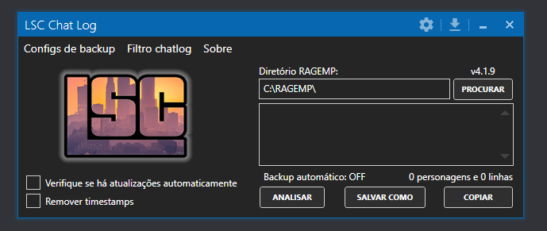

# Assistente chatlog LSC
Este programa é utilizado para converter os chatlogs gerados enquanto você joga no LSC em texto legível.

## Primeiros Passos

Não é necessário realizar nenhuma instalação. Basta baixar a [última versão](https://github.com/yuribraga17/LSC-Log-Parser) e executar o arquivo executável.

## Compilando

Certifique-se de restaurar as dependências do pacote NuGet antes de compilar o projeto.

## Contribuindo

1. Faça um Fork do projeto (<https://github.com/seu_nome/LSC-Log-Parser>)
2. Crie um Branch (`git checkout -b nome_do_branch`)
3. Realize o Commit (`git commit -am "Adicionar nova_funcionalidade"`)
4. Faça o Push (`git push origin nome_do_branch`)
5. Crie um Pull Request

## Informações Adicionais

Distribuído sob a licença GPLv3. Consulte o arquivo ``LICENSE`` para mais informações.
